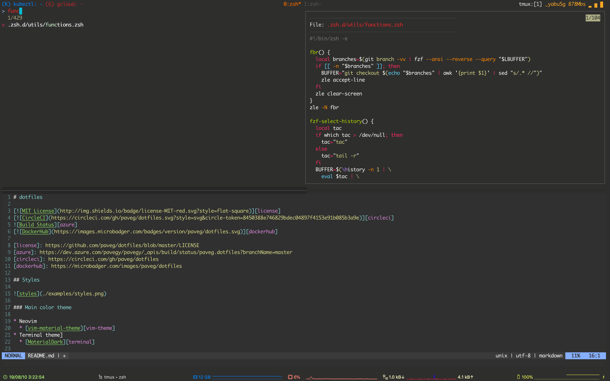

# dotfiles

[][circleci]
![Build Status][azure]
[][dockerhub]

[azure]: https://dev.azure.com/pavegy/pavegy/_apis/build/status/paveg.dotfiles?branchName=master
[circleci]: https://circleci.com/gh/paveg/dotfiles
[dockerhub]: https://microbadger.com/images/paveg/dotfiles

## Styles



## Prepare

### linux

- Please install Linuxbrew. ( [Repository](https://github.com/Linuxbrew) )

### macOS

- Please install brew.

## Quick Start

```bash
$ git clone https://github.com/paveg/dotfiles $HOME/dotfiles
$ cd dotfiles && make install
```

## Configuration

### Environment

|key|value|
|:---:|:---:|
|ONELOGIN_AWS_MAIL|onelogin aws email|

## Constitution

* [brew](https://github.com/Homebrew/brew) - package manager
* [zsh](http://www.zsh.org/) - THE Z SHELL (ZSH)
* [zplug](https://github.com/zplug/zplug) - zsh plugin manager
* [pure](https://github.com/sindresorhus/pure) - Pretty, minimal and fast ZSH prompt
* [neovim](https://github.com/neovim/neovim) - Neovim is a project that seeks to aggressively refactor Vim
* [anyenv](https://github.com/anyenv/anyenv) - All in one for \*\*env

---

* [bat](https://github.com/sharkdp/bat) - A cat(1) clone with wings
* [exa](https://github.com/ogham/exa) - A modern version of ‘ls’

### Directory

```textmate
~/dotfiles
pav@ryota-3.local ❯❯❯ tree -aL 3 --dirsfirst -I '.git|.idea|*.zwc|.zcompdump' .
.
├── .circleci
│   └── config.yml
├── .zsh.d
│   ├── utils
│   │   ├── alias.zsh    # Define the alias you usually use
│   │   ├── core.zsh     # Define core zsh configuration
│   │   ├── env.zsh      # Define environment
│   │   ├── function.zsh # Define convenient function
│   │   ├── keybind.zsh  # Define zsh key bindings
│   │   └── zplug.zsh    # Zsh plugin manager configuration
│   ├── .zprofile        # Source only once library at startup terminal
│   ├── .zshenv          # Actual zsh environment
│   └── .zshrc           # Normal zshrc; defined common zsh configuration
├── etc
│   ├── initvim          # Init nvim shellscript
│   ├── inittmux         # Init tmux shellscript
│   └── installer        # Installer dotfiles
├── examples
│   └── styles.png       # Example image for README.md
├── lib
│   └── utilities.sh     # Utility bash shell functions
├── nvim
│   ├── dein
│   │   ├── lazy.toml    # Lazy load plugins
│   │   ├── plugins.toml # Dein plugins
│   │   └── python.toml  # Python plugins
│   ├── rc
│   │   └── plugins.vim  # Init plugins
│   └── init.vim         # Initialize vim, a.k.a .vimrc
├── pkg
│   ├── brew.txt         # Brew package list
│   └── brew_cask.txt    # Brew cask package list
├── .dockerignore
├── .gitconfig           # Global gitconfig, linked $XDG_CONFIG_HOME/git/config
├── .gitignore
├── .tmux.conf           # Tmux configuration file
├── .zshenv              # Invite you to zsh
├── Dockerfile
├── LICENSE
├── Makefile
├── README.md
└── azure-pipelines.yml
```

## Continuous Integration

**Keep building the development environment continuously**

#### **Do not stop development\!**
